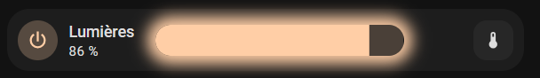

# Custom Home Assistant Cards

**A living collection of custom Lovelace card examples for Home Assistant**

This repository demonstrates how to create beautiful, interactive Lovelace dashboards. Each example is self-contained, with its own prerequisites, YAML snippet, and usage instructions, so you can pick and choose exactly what you need.

------

## Table of Contents

1. [Introduction](#introduction)
2. Mushroom Light Card with Glowing Slider
   - [Prerequisites](#prerequisites-1)
   - [Code Snippet](#code-snippet)
   - [How It Works](#how-it-works)
   - [Usage](#usage)
3. [Additional Tips](#additional-tips)
4. [References](#references)

*(Add more examples here as you expand your collection.)*

------

## Introduction

If you’re new to Home Assistant, custom cards let you go beyond the default UI by adding extra functionalities and polished styles. In most cases, you’ll install them via **HACS (Home Assistant Community Store)** or manually copy the resources to your `www` folder.

> **Note:** You should already have a working Home Assistant installation. If not, check out the [Home Assistant official docs](https://www.home-assistant.io/).

------

## Mushroom Light Card with Glowing Slider

A **custom:mushroom-light-card** that includes a dynamically glowing slider based on the light’s brightness and color attributes.

### Prerequisites

1. **Home Assistant** (any supported install).
2. **(Optional) HACS** – for easy installation of community cards.
3. **Mushroom Cards** – [GitHub Repo](https://github.com/piitaya/lovelace-mushroom) (install via HACS or manually).
4. **card-mod** – [GitHub Repo](https://github.com/thomasloven/lovelace-card-mod), if you plan to customize the card’s CSS.

*(If you already have everything set up, skip straight to the code!)*

### Code Snippet




```yaml
type: custom:mushroom-light-card
entity: light.ikea_salon
show_brightness_control: true
collapsible_controls: false
show_color_control: true
name: Lumières
fill_container: false
use_light_color: true
show_color_temp_control: true
layout: horizontal
primary_info: name

double_tap_action:
  action: perform-action
  perform_action: switch.turn_on
  target:
    entity_id: switch.niko_eclairage_salon

hold_action:
  action: perform-action
  perform_action: switch.turn_off
  target:
    entity_id: switch.niko_eclairage_salon

icon: mdi:power

card_mod:
  style:
    mushroom-shape-icon$: |
      .shape:active {
        transform: scale(1.2);
      }
    .: |
      mushroom-light-brightness-control, mushroom-light-color-temp-control,
      mushroom-light-color-control {      
        position: absolute;
        margin-left: 2%;
        width: 48%;
        transition: box-shadow 2s ease-in-out;
        --control-height: 2em;
        
        box-shadow: 0 0 0.95rem {{ state_attr('light.ikea_salon','brightness') /255 }}vh #{{ '%02x%02x%02x' | format((state_attr('light.ikea_salon','rgb_color') | list )[0], (state_attr('light.ikea_salon','rgb_color') | list )[1], (state_attr('light.ikea_salon','rgb_color') | list )[2]) }};
        border-radius: var(--ha-card-border-radius, 12px);
        transition: box-shadow 0.5s ease-in-out;
        
        border-radius: var(--ha-card-border-radius, 12px);
        --control-border-radius: var(--ha-card-border-radius, 12px);
      } 
      mushroom-state-item {
        z-index: 1;
        max-width: fit-content;
        margin-bottom: 0px;
        pointer-events: none;
        border: solid 5px var(--card-mod-icon-color);
      } 
      mushroom-shape-icon {
        pointer-events: auto;
      }  
      mushroom-button {
        position: absolute;
        width: calc(var(--control-height) * var(--control-button-ratio)) !important;
        height: var(--control-height) !important;
        top: var(--spacing);
        right: var(--spacing);
      }
      mushroom-button:nth-child(3) {
        right:  calc(2 * var(--spacing) + var(--control-height) * var(--control-button-ratio));
      }
      .actions :not(:last-child) {
        margin-right: 0px !important;
      }

```

### How It Works

- **Glow Effect**: Uses **Jinja2** in `box-shadow` to scale glow intensity based on the brightness attribute (`brightness / 255`).
- **Color Matching**: Pulls the current RGB color from the entity state to match the glow with the actual light color.
- **Double Tap / Hold Actions**: Custom actions trigger a separate `switch` entity (useful for multi-gang switches or advanced lighting setups).
- **CSS Tweaks**: `card_mod` changes position, size, and transitions for elements like the brightness slider and buttons.

### Usage

1. Copy-paste the YAML code into your Lovelace dashboard (via YAML mode or the Raw Configuration Editor).
2. Update `light.ikea_salon` and `switch.niko_eclairage_salon` with your own entity IDs.
3. Tweak the `box-shadow`, transitions, or `border-radius` to your liking.
4. Save and reload. You should see a new light card with a glowing brightness slider when the light is on.

------

## Additional Tips

- **Performance Considerations**
   Animated glows can be a bit heavy on low-power devices. Monitor performance if you use multiple glowy elements.
- **Experiment with Animations**
   `transition: box-shadow 2s ease-in-out;` can be changed for different speeds or effects. Try `ease`, `linear`, or even `cubic-bezier`.
- **Keep a Backup**
   If you’re heavily modifying a card’s YAML or CSS, make a quick copy in case you need to revert.

------

## References

- **[Home Assistant Lovelace Docs](https://www.home-assistant.io/lovelace/)** – Official guide on customizing your Lovelace UI.
- **[Mushroom Cards GitHub](https://github.com/piitaya/lovelace-mushroom)** – For updates, new features, and community ideas.
- **[card-mod GitHub](https://github.com/thomasloven/lovelace-card-mod)** – A must-have for CSS-level customization in Lovelace.

------

**Stay Tuned!** We’ll be adding more examples—each with its own prerequisites, code snippets, and usage instructions. If you have a cool configuration to share, feel free to open a PR or issue.

**Happy Theming!**
